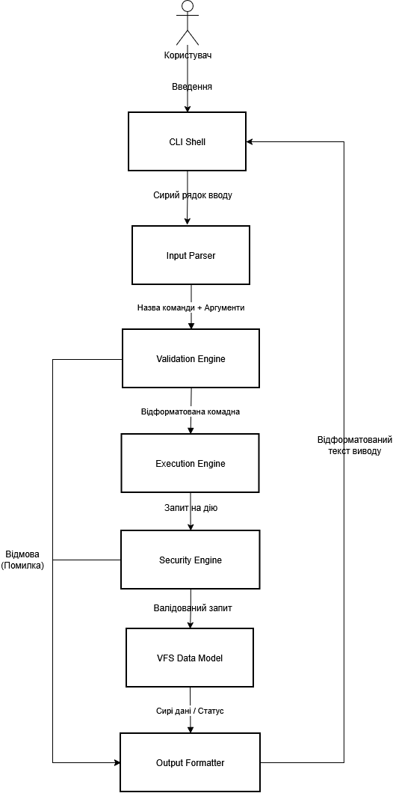
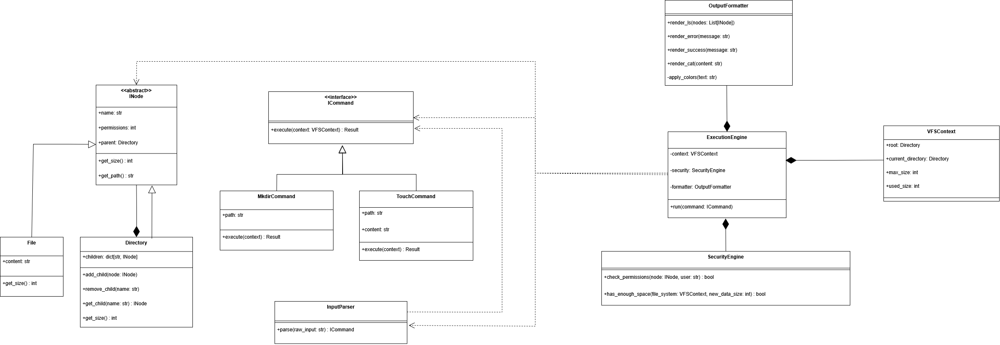

# Звіт з конструювання програмного забезпечення

**КИЇВСЬКИЙ НАЦІОНАЛЬНИЙ УНІВЕРСИТЕТ імені Тараса Шевченка ФАКУЛЬТЕТ ІНФОРМАЦІЙНИХ ТЕХНОЛОГІЙ**
**Дисципліна:** Конструювання програмного забезпечення  
**Проект:** VFS Shell (Симулятор віртуальної файлової системи)  
**Студент:** Плахота Роман Сергійович
**Група:** ІПЗ-34-10
**Перевірив:** Павло ШАБАТІН

---

## 1. Діаграма компонентів (Component Diagram)

Система розділена на окремі однозадачні модулі для забезпечення принципів Single Responsibility та полегшення тестування кожного компонента окремо.

### Високорівневий поділ на модулі:

1. **CLI Shell**: Точка входу в програму. Забезпечує інтерактивний інтерфейс з користувачем, підтримує зчитування команд як в реальному часі, так і з пакетних .sh файлів.

2. **Input Parser**: Модуль текстового аналізу. Перетворює вхідний рядок на структурований об'єкт команди, коректно обробляючи аргументи, шляхи та лапки (наприклад, вміст файлів у touch).

3. **Validation Engine**: Відповідає за синтаксичну валідацію. Перевіряє, чи існують введені команди та чи відповідають передані аргументи очікуваним типам даних (наприклад, чи є розмір диска в mkfs числом).

4. **Security Engine**: Модуль перевірки бізнес-логіки та безпеки. Здійснює контроль прав доступу та перевіряє доступні дискові квоти перед виконанням операцій запису.

5. **Execution Engine**: Центральний диспетчер. Координує роботу інших модулів, ініціалізує відповідні об'єкти команд та викликає їх виконання, взаємодіючи з моделями даних.

6. **VFS Data Models**: Внутрішнє представлення файлової системи. Реалізує структуру N-арного дерева в оперативній пам'яті, де зберігаються об'єкти файлів та директорій.

7. **Output Formatter**: Модуль представлення. Отримує сирі дані від моделі або повідомлення про помилки та форматує їх у зручний для читання вигляд (таблиці, кольоровий текст) перед виводом у Shell.

### Напрямок потоку даних:

Потік даних у системі є лінійним з боку вводу та циклічним з боку виводу:

Користувач -> CLI Shell -> Сирий рядок вводу -> Input Parser -> Назва команди + Аргументи -> Validation Engine -> Відформатована комадна -> Execution Engine -> Запит на дію -> Security Engine -> Валідований запит до моделі -> VFS Data Models -> Сирі дані/Статус -> Output Formatter -> Відформатований текст виводу -> CLI Shell -> Екран користувача.

### Діаграма компонентів:

## 2. Опис інтерфейсів та методів (Class Diagram)

Архітектура системи базується на поєднанні двох фундаментальних патернів проектування: **Composite** для структури даних та **Command** для обробки операцій. Це дозволяє відокремити внутрішню логіку файлової системи від зовнішніх команд.

### Логіка взаємодії компонентів

Взаємодія між модулями побудована за принципом низької зв'язності. Основний цикл роботи виглядає наступним чином:

1. **Ініціація запиту**: ExecutionEngine отримує від користувача рядок вводу. Він не розбирає його самостійно, а делегує це завдання InputParser.

2. **Фабрика команд:** InputParser аналізує текст, визначає тип операції та створює відповідний об'єкт команди (наприклад, TouchCommand), що реалізує інтерфейс ICommand.

3. **Оркестрація та перевірка:** ExecutionEngine бере створену команду та звертається до SecurityEngine. Останній перевіряє:
    - Чи має поточний користувач права на зміну структури вузла.
    - Чи не призведе операція запису до перевищення ліміту max_size.

4. **Виконання:** Якщо перевірки успішні, викликається метод execute(). Команда взаємодіє з VFSContext, змінюючи стан дерева об'єктів INode (дочірніх класів File або Directory).

5. **Візуалізація:** Результат операції (дані або помилка) передається до OutputFormatter, який відповідає за кінцеве представлення інформації в інтерфейсі користувача.

### Ключові абстракції

- **INode**: Спільний абстрактний клас для файлів та директорій. Він реалізує патерн Composite, дозволяючи системі працювати з будь-яким елементом ієрархії поліморфно. Це означає, що команди можуть викликати методи на кшталт get_size() або get_permissions(), не перевіряючи, чи є об'єкт конкретним файлом чи папкою.

- **ICommand**: Ключовий інтерфейс для реалізації патерну Command. Кожна операція в системі (створення папки, читання файлу, зміна прав тощо) є окремим класом, що реалізує цей інтерфейс. Це дозволяє ExecutionEngine виконувати будь-яку дію через уніфікований метод execute(), забезпечуючи легке розширення функціоналу без зміни коду ядра.

- **VFSContext**: Об'єкт-стан який інкапсулює поточне середовище виконання. Він зберігає посилання на кореневий вузол, поточну робочу директорію (CWD) та глобальні ліміти системи. Контекст передається у кожну команду, забезпечуючи їх необхідними даними для виконання, але обмежуючи доступ до глобальних змінних програми.

### Діаграма класів:

## 3. Опис структур даних та обґрунтування

Для забезпечення ефективної роботи системи в оперативній пам'яті та досягнення оптимальної складності операцій, було обрано наступні структури даних:

1. **N-арне дерево**

    Місце використання: Це основа всієї файлової системи. Кожен вузол (INode) є частиною дерева, де корінь — це **/**, а гілки та листя — це директорії та файли.

    Обґрунтування: Файлова система за своєю природою є ієрархічною. Дерево дозволяє природним чином реалізувати вкладеність. Використання N-арного дерева де кожен вузол може мати довільну кількість нащадків дозволяє виконувати рекурсивні операції, такі як обчислення загального розміру папки або видалення цілих гілок з мінімальними витратами ресурсів.

2. **Хеш-таблиця (Python Dict)**

    Місце використання: В середині класу Directory для зберігання посилань на дочірні об'єкти. Ключем є ім'я файлу/папки, а значенням — об'єкт INode.

    Обґрунтування: Це забезпечує асимптотичну складність пошуку O(1). У системі, де часто виконуються операції cd, ls або cat, важливо миттєво знаходити потрібний вузол за його назвою. Словник також автоматично гарантує унікальність імен файлів у межах однієї директорії.

3. **Бітові маски (Integer)**

    Місце використання: Для зберігання та перевірки прав доступу (permissions).

    Обґрунтування: Використання цілих чисел для представлення вісімкових значень (наприклад, 755) дозволяє зберігати інформацію про права власника, групи та інших користувачів у мінімальному об'ємі пам'яті. Перевірка прав у SecurityEngine виконується за допомогою швидких побітових операцій (&, |), що імітує логіку реальних Unix-систем.

4. **Стек (Stack / List)**

    Місце використання: Для обробки шляхів та навігації.

    Обґрунтування: При розборі шляху (наприклад, /home/user/../docs), система розбиває його на компоненти. Стек дозволяє легко обробляти переходи на рівень вище (..): ми просто робимо pop() поточного елемента зі стеку. Це найбільш надійний спосіб перетворення відносних шляхів у абсолютні без помилок навігації.

5. **Рядкові буфери (Strings)**

    Місце використання: Зберігання вмісту файлів у класі File.

    Обґрунтування: Оскільки симулятор працює виключно в пам'яті, Python-рядки є ефективними для зберігання текстових даних. Вони дозволяють легко обчислювати розмір файлу через len() та інтегруватися з модулем OutputFormatter.